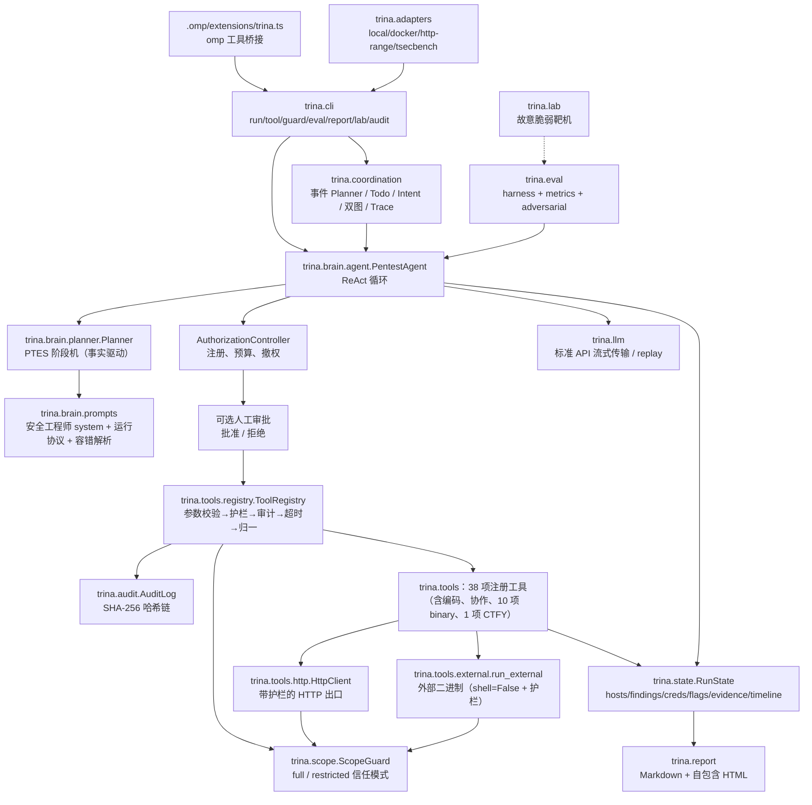

# 架构与模块契约

决策流程及每一步的设计理由详见[《设计决策》](../设计决策.md)。该文按实际执行顺序展开输入输出、规则、替代方案、失败分支和验证依据；本页保留总体模块契约。系统提示词与 Commander 情报部分于 2026-11-11 对照实现核对。

## V2：事件驱动 Swarm 运行层

`trina swarm` 在现有单 Agent 执行链外增加 `SwarmRuntime` 与 `CoordinationRuntime`。Commander 验证 DAG；事件驱动 Planner 只在 Intent、事实或终态发生变化时推进，不因 Worker 的每个 ReAct 步骤重新规划。共享 Todolist 持久保存目标和依赖；Intent 队列负责优先级、等价去重、领取租约、超时回收与终态。事实图只存实际验证结果，探索图存尚未完成的 Intent、依赖和事实锚点。Worker 的完整 ReAct 上下文、`RunState`、工作目录、审计和报告仍按题隔离，但可查询其他 Worker 有来源的观察与失败留痕。网络目标和工具动作仍由 `ScopeGuard` 与注册表执行链处理；默认 full 信任，restricted 才做边界拒绝。详见 [Swarm 使用说明](SWARM.md)。

## 1. 总览


```mermaid
flowchart TB
    CLI["trina.cli<br/>run/tool/guard/eval/report/lab/audit"]
    OMPEXT[".omp/extensions/trina.ts<br/>omp 工具桥接"]
    AGENT["trina.brain.agent.PentestAgent<br/>ReAct 循环"]
    PLANNER["trina.brain.planner.Planner<br/>PTES 阶段机（事实驱动）"]
    PROMPTS["trina.brain.prompts<br/>安全工程师 system + 运行协议 + 容错解析"]
    POLICY["AuthorizationController<br/>注册、预算、撤权"]
    APPROVAL["可选人工审批<br/>批准 / 拒绝"]
    REG["trina.tools.registry.ToolRegistry<br/>参数校验→护栏→审计→超时→归一"]
    GUARD["trina.scope.ScopeGuard<br/>full / restricted 信任模式"]
    AUDIT["trina.audit.AuditLog<br/>SHA-256 哈希链"]
    STATE["trina.state.RunState<br/>hosts/findings/creds/flags/evidence/timeline"]
    COORD["trina.coordination<br/>事件 Planner / Todo / Intent / 双图 / Trace"]
    TOOLS["trina.tools：38 项注册工具（含编码、协作、10 项 binary、1 项 CTFY）"]
    HTTP["trina.tools.http.HttpClient<br/>带护栏的 HTTP 出口"]
    EXT["trina.tools.external.run_external<br/>外部二进制（shell=False + 护栏）"]
    LLM["trina.llm<br/>标准 API 流式传输 / replay"]
    ADAPT["trina.adapters<br/>local/docker/http-range/tsecbench"]
    EVAL["trina.eval<br/>harness + metrics + adversarial"]
    LAB["trina.lab<br/>故意脆弱靶机"]
    REPORT["trina.report<br/>Markdown + 自包含 HTML"]

    CLI --> AGENT
    CLI --> COORD
    OMPEXT --> CLI
    AGENT --> PLANNER --> PROMPTS
    AGENT --> LLM
    COORD --> AGENT
    AGENT --> POLICY --> APPROVAL --> REG
    REG --> GUARD
    REG --> AUDIT
    REG --> TOOLS
    TOOLS --> HTTP --> GUARD
    TOOLS --> EXT --> GUARD
    TOOLS --> STATE
    AGENT --> STATE
    STATE --> REPORT
    ADAPT --> CLI
    EVAL --> AGENT
    LAB -.-> EVAL
```

## 2. 单步数据流

```
人工信号与任务剩余时间
    → GoalRequirements 缺口 + Planner 阶段 + 台账与方向调度
    → RunState 摘要 + 上一步观察 + 提示 + 预算
    → LLM 返回文本 → parse_action()
        ├─ 非法协议：记录错误并反馈下一轮
        ├─ final：检查目标缺口，最多拒绝两次提前结束，再按事实收尾
        └─ action：提取 test_id / target，计算候选动作等级，登记或引用假设
             → AuthorizationController.check（注册 / 预算 / 撤权）
             → 可选人工审批
             → ToolRegistry.execute(name, params, ctx)
                 ├─ 参数校验（未知 / 缺失 / 类型 / enum）
                 ├─ 工具可用性
                 ├─ 根据规范化参数计算等级，检查护栏与目标
                 ├─ tool.start → 工具执行与等待超时
                 └─ facts / evidence 吸收 → tool.end
             → 知识摘要变化、假设更新、失败分类、重复检测、调度遵从
             → 预算停止合同与周期快照
             → 下一步观察，或统一收尾
```

该顺序对应任务模式。控制器允许发生在完整工具参数校验和实际完成之前，故 `executed` 不能直接用作成功覆盖证明。对话模式共用执行组件，但没有相同的阶段机、方向调度和任务收尾流程。

## 3. 模块契约

| 模块 | 关键类型 / 函数 | 约定 |
|---|---|---|
| `trina.config` | `TrinaConfig.load(path, overrides)`、`ScopeConfig`、`scope_prompt_block()`、`runtime_root` | `scope.trust_mode` 默认 `full`，`restricted` 恢复旧边界；环境变量可覆盖标量；未知字段直接报错；源码产物写项目根、Wheel 产物写 `~/.trina` |
| `trina.scope` | `ScopeGuard.check_target/check_argv/check_payload/check_http/check_action_level/check_destructive/check_brute_scale/throttle`；`Decision`；`ScopeViolation` | full 模式对合法格式直接放行；restricted 按网段、等级、破坏性、禁止模式和规模裁决；两者都记录审计并保留限速与执行租约 |
| `trina.audit` | `AuditLog.open/append/verify/summary` | 每条记录 `hash = sha256(canonical(record - hash))`，`prev_hash` 链接；写入即 fsync；敏感字段自动脱敏 |
| `trina.events` | `EventBus.publish/replay/subscribe/wait`、`EventSubscription.poll/ack`、`ModelEventStream` | 模型、工具、后台作业和调度共用持久事件流；SQLite 提交后按序投递，以 `(stream_id, seq)` 标识事件；显式确认命名消费者游标，重放不执行动作；详见[事件协议](EVENTS.md) |
| `trina.event_view` | `EventTranscript.consume` | 实时与重放共用投影；按调用 ID 更新工具窗口，正文直接排版，按事件身份去重 |
| `trina.state` | `RunState.absorb(facts)`、`add_finding`、`knowledge_digest`、`summary_for_prompt`、`to_dict/from_dict` | 工具声明 facts，状态集中合并；`knowledge_digest` 排除时间、重复条目与笔记，用事实变化计算进展；`from_dict` 供工作台/复核读历史运行 |
| `trina.tools.registry` | `ToolSpec`/`ParamSpec`/`ToolResult`/`ToolContext`/`Tool`/`ToolRegistry.execute` | 执行链是**唯一**入口；工具实现 `run(ctx, **params)`，返回 `ToolResult` |
| `trina.tools.workspace` | `terminal_exec`、`workspace_read/write/edit` | 前台 argv 命令和项目文件编码工具；命令经 `run_external`，路径经 `ScopeGuard.check_workspace_path`，写入原子替换，编辑要求精确匹配数 |
| `trina.coordination` / `trina.tools.coordination` | `CoordinationRuntime.plan/claim/settle/publish_state/search_traces`、`shared_context/shared_trace_*` | 事件驱动规划、共享 Todo、Intent 租约/去重/恢复、事实图与探索图、跨 Worker 可追踪观察和失败；不共享完整对话或直接合并当前题事实 |
| `trina.binary` / `trina.tools.binary` | `BinarySessions`、`R2Backend`、`GDBBackend`、`AddressRef`、10 个语义化工具 | r2 stdio JSON 与 GDB/MI3 持久会话；按任务和能力租约隔离，地址空间显式，完整协议写证据；见 [二进制工具链](BINARY_TOOLS.md) |
| `trina.ctfy` / `trina.tools.ctfy` | `CTFYTask`、`run_ctfy`、`ctfy_task` | CTFY v3 instance/QA 任务读取、门控刷新和平台权威提交；不读取个人模型配置；见 [CTFY 接入](CTFY.md) |
| `trina.tools.http` | `HttpClient.request/get/post`、`HttpResult.as_evidence()` | 出网唯一出口：护栏 → 限速 → 请求 → 证据化；护栏拒绝时返回带 `error` 的结果而不是抛异常 |
| `trina.tools.external` | `run_external(argv, ctx, …)`、`which/have` | `shell=False`、先护栏后执行、命令与输出摘要进审计 |
| `trina.brain.agent` | `PentestAgent(config, registry=, backend=, on_step=, shared_context=).run(target, goal=, max_steps=, max_seconds=, record_path=) -> RunState` | 评测框架与 CLI 继续使用原签名；Swarm 可额外注入只读协作上下文，不改变单 Agent 路径 |
| `trina.brain.planner` | `Planner.tick/objective_met/force_advance/should_finish` | 阶段推进只看**事实**；每阶段有步数预算，停滞可推进；不向模型注入阶段作业攻略 |
| `trina.brain.goal` | `GoalRequirements.parse(goal)`、`unsatisfied(state)/soft_hints/satisfied` | 漏洞类与端口形成硬条件；路径在没有类要求时为硬条件，否则为提示；凭据形成验证提示。最终成功依据已表达的条件，不读取 ground truth；关键词解析不能表达全部自然语言语义 |
| `trina.hypotheses` | `HypothesisLedger.add/from_action/record_tool_outcome/record_outcome/prompt_block/finalize/summary` | 假设的排序/状态机与证据判定；模型仍选择动作，但确定性选取由 `trina.brain.scheduler` 每步派发；任务/对话共用验证对象匹配；`hypothesis_id` 复用台账；无新信息只降优先级，明确反证才能否定 |
| `trina.brain.failure` | `classify_failure`、`LoopGuard.observe`、`advice_for`、`alternatives_for` | 失败归因（boundary/tool/environment/budget/hypothesis）+ 无新信息重复识别，给出递进建议（换参数→换工具→人工） |
| `trina.brain.scheduler` | `HypothesisScheduler.decide(ledger, tests, executed_tests=, goal_classes=)`、`observe(decision, test_id=, tool=)` | **确定性假设调度**：只调度能绑定注册检查项的假设；任务要求的漏洞类优先（无假设时直接派该类检查项）；未遵从进审计链与 `state.scheduler` |
| `trina.evidence_graph` | `build(state, registry=, hypotheses=)`、`EvidenceGraph.to_mermaid/to_dict` | 结论可反向追溯：目标→主机→端口→路径→发现→证据，另有检查项/假设→发现；构建失败不影响报告 |
| `trina.board` | `render_board(state, hypotheses=)`、`summarise`、`latest_state_file`、`load_run_state` | 工作台视图的**唯一**渲染实现（控制台 `/board` 与 `trina watch` 共用）；`load_run_state` 把 state.json 还原成 `RunState` |
| `trina.brain.prompts` | `action_example`、`render_system_prompt`、`build_system_prompt`、`build_runtime_context`、`build_step_prompt`、`parse_action` | 任务、对话与通用 Worker 共用七模块比赛 Agent system，覆盖多类 CTF；聊天允许直接回答，二进制说明按需适用；动作协议、范围、工具与任务事实仍由运行数据提供，详见 [提示词说明](PROMPTS.md) |
| `trina.context` | `normalize_briefs`、`render_commander_briefs`、`brief_digest` | 只处理 Commander 定向情报；不合并其他题目的事实、证据、Flag、假设或历史；接收方重新验证后才可写入本题状态 |
| `trina.conversation` | `ConversationContext.state_update/prepare/before_request/after_response` | 每任务状态差量、周期完整状态、原子归档及继承检查点；保护用户约束、事实和最近工具链；区分可见前缀变化与实际用量 |
| `trina.llm.cache` | `CachePolicy.for_request/apply` | 供应商缓存字段在请求边界适配；内部前缀标识、明确能力及一次有界降级；不推测服务端 KV 命中 |
| `trina.chat_store` | `ChatStore.save/list/load/acquire` | 按项目保存 SQLite 事务快照，列表只查元数据；对话独占锁先于读取；不导出供应商配置、不执行历史动作 |
| `trina.session_title` | `generate_session_title`、`fallback_session_title`、`parse_generated_title` | 首条有效请求用隔离的小型标题协议生成目标级短标题；标题请求不进入主对话上下文，失败时确定性降级，低信息输入保持“新对话” |
| `trina.brain.chat` | `ChatAgent.ask/save/close`、`ChatAgent.resume(config, run_id, **kwargs)` | **对话式大脑**：使用标准 API 的原生 `tools` / `tool_calls` 并维护 assistant-tool 配对；JSON/DSML 仅为兼容回退且不会显示成正文；共用护栏、控制器、审计和审批；自动保存及跨实例恢复，但不恢复旧进程或重放工具 |
| `trina.llm` | `complete_messages(messages, on_event=, tools=)`、`LLMStreamEvent`、`LLMUsage` | 标准结构化消息与三个 API 方言的 SSE 解析；稳定前缀、终止事件校验与真实用量汇总；OMP 后端已删除 |
| `trina.providers` / `trina.model_ui` | `ProviderPreset`、`ProviderProfile`、`ProfileStore`、`ModelManager` | 以供应商整条配置管理地址、单个 Key、模型、备注、思考档位与上下文窗口；只接受仓库外的 v2 文件，旧格式明确拒绝；编辑、切换与删除由同一管理层原子保存 |
| `trina.provider_form` | `ProviderEditor` | 单页草稿表单；测试通过回调复用 LLM 后端，字段修改使旧结果失效，保存前校验，取消和测试不写入配置，不切换当前供应商 |
| `trina.adapters` | `load_adapter/list_adapters`、`RangeAdapter.prepare/status/ground_truth/check_flag`、`score_tsecbench` | 靶场自描述（目标 + ground truth + flag 模式），评测框架据此自动判分 |
| `trina.bench` | `BenchmarkClient`、`BenchmarkRunner`、`run_benchmark`、`submission_candidates` | 平台答题 API：控制面鉴权只认 `control_plane_hosts`；逐题串行 start→agent→submit→close，flag 提取优先 state.flags |
| `trina.policy` | `PolicyRegistry.load()`、`AuthorizationController.check/note_evidence/revoke/coverage`、`Budget` | **计划器提出、控制器批准**：注册目标/检查项 + 预算 + 撤权，逐动作裁决；模型无写权限 |
| `trina.session` | `Session.request_approval/answer/steer/toggle_pause/request_stop`、`level_needs_approval` | 人机协同原语；审批**超时即拒绝**（fail-closed） |
| `trina.play` | `build_plan(config, target=, range_name=)`、`run_plan(config, plan, approval=, steer_queue=, …)` | 一条命令开打的准备与执行；谁拉起靶机谁负责回收 |
| `trina.terminal` | `render_home/render_panel/render_message/render_step/render_approval` | CLI 统一展示；按显示宽度折行并清除外部控制字符，正式输出支持 Markdown；无色和无 rich 时降级；不参与模型上下文或动作执行 |
| `trina.console_state` | `ConsoleContext`、`ConsoleState`、`TrackedBackend` | 底栏读取当前运行模型、目录、短会话名和步骤；横线展示最近一次当前输入量相对上下文窗口的占用，累计 Token 另行统计；跨模型累计、建新会话清零，未知用量不伪造，不修改提示词、动作、授权或后端账本 |
| `trina.console_ui` | `EnhancedConsoleInput.run/write/update_stream/update_tool` | 持续全屏内容区与固定底部输入、索引和用量；正文增量与工具窗口原位更新，保留输入草稿；模型表单临时接管终端后恢复 |
| `trina.transcript` | `TranscriptControl.sync/create_content/precondition_scroll/selected_text/copy_selection` | 脏块一次完成 ANSI/Unicode 物理行折行，视口使用直接行偏移；VT 终端以滚动区域搬运不变行并同步差分旧屏，失败时退回普通重绘；流式更新只重排变化块；支持拖选复制与原生鼠标模式切换 |
| `trina.runtime_status` | `status_snapshot/render_agent_status` | 模型请求末尾的动态运行快照，独立于屏幕底栏；保持消息前缀，任务、工具和作业数据只取当前上下文 |
| `trina.tools.terminal` / `BackgroundJobs` | `terminal_start/status/stop`、`run_external(background=True)` | 当前任务专属的有界后台作业；真实退出码、超时和进程树回收；监视线程不写漏洞事实 |
| `trina.interactive` | `Console(config, input_fn=, output=).run()/handle(line)` | 行式交互控制台；空闲命令复用 CLI，运行中支持介入、状态和只读工作台；2026-10-28 展示更新见 [CLI 说明](CLI_UI.md) |
| `trina.review` | `review_state(state, audit_path=, registry=) -> ReviewNote`、`ReviewNote.to_markdown()` | 评价 Agent（只读）：核对声明/证据、结论一致性、覆盖缺口、边界事件、审计链 |
| `trina.eval` | `EvalHarness(config, runner=).run(suite)`、`compute_metrics`、`AdversarialProxy` | `runner` 可注入，便于离线/回放评测 |
| `trina.report` | `build_report(state, cfg, meta=, audit_summary=) -> Report`、`Report.save()` | HTML 自包含（内联 CSS/SVG，无外部资源）；章节含"六、证据链与假设台账"（Markdown 带 mermaid，HTML 用起点-关系-终点表） |

## 4. 关键设计决策与理由

| 设计选择 | 解决的问题及理由 | 代价和限制 |
|---|---|---|
| 宿主自有循环、后端可替换 | 授权、状态和收尾有明确程序入口，模型连接与业务控制解耦 | 需要维护解析、反馈、上下文和不同入口的一致性；通用框架并非天然不能满足要求 |
| 单步 JSON 动作 | 每次执行后使用新观察，参数可校验，轨迹可录制 | 增加模型往返；解析器仍需容错与语义校验 |
| 目标约束独立于 final | 防止顺路 flag 或模型自评代替指定验证 | 当前是关键词规则，复杂目标和精确位置语义有限 |
| 阶段骨架加动态动作 | 用事实和阶段预算组织重点，保留根据新线索调整的空间 | 阶段可以预算推进，进入 exploit 不等于利用成功 |
| 假设台账与方向调度 | 记录待验证对象，比较期望检查与实际动作 | 优先级是启发式，绑定主要按漏洞类，调度不直接执行 |
| 控制器、审批与护栏分层 | 注册及预算、操作者判断、实际参数及传输分别裁决 | 提前允许记录与成功完成仍需区分，入口调用关系需要单独核对 |
| 工具统一契约 | 避免各工具遗漏参数、异常、审计和状态处理 | 仍信任工具返回的事实，尚无通用独立重放验证 |
| 内置能力与外部工具适配 | 常见能力在缺少外部二进制时可有降级路径 | 各工具能力与依赖不同，不能承诺全部外部能力均有等价内置实现 |
| 知识摘要与重复指纹 | 时间变化、重复发现不能持续冒充新进展 | 字段归一化不理解全部语义，raw 中变化文本仍可能影响指纹 |
| 哈希链、快照和报告 | 分别保存过程一致性、当前状态和可读派生视图 | 哈希链没有外部可信锚；快照读取不等于进程续跑 |

各选择的完整依据、计算示例、方案比较和验证见[设计决策](../设计决策.md)；控制归属见 [ADR-0001](../design/adr/0001-brain-own-react-loop.md)。

## 5. 错误隔离与收敛

| 情形 | 行为 |
|---|---|
| 工具抛异常 | 捕获 → `ToolResult(ok=False, error=…)`，计入 `counters.errors`，审计 `tool.error`，循环继续 |
| 工具超时 | 共享有界执行器返回超时错误并撤销执行租约；隔离状态不提交，后续 guard/http/audit/log/工件写入被拒绝。Python 线程不会被强制终止，在途 I/O 仍受自身超时约束 |
| LLM 调用失败 | 鉴权拒绝和余额/额度不足直接停止；协议不支持按配置有界降级；恢复性故障单次决策最多尝试 5 次，间隔 2/4/6/8 秒。每次错误和重试均进入统一事件流并回显，外层仍受错误分类预算及共享 errors 上限约束 |
| 模型输出非 JSON | 多级容错解析 → 仍失败则注入"只输出 JSON"提示并继续（计入 errors） |
| 动作被护栏拒绝 | 拒绝结果 + `hint` 回灌；计入 `counters.denied`；写入审计 `tool.denied` |
| 同一动作重复 | stall 首次为 0，默认阈值 3 通常在连续第 4 次相同动作触发纠正与阶段推进；不等于直接结束任务 |
| 步数/时长耗尽 | 在相应检查点退出并按事实收尾；模型重试、线程和在途请求具有独立等待边界 |
| 目标越界 | 预检阶段直接 `blocked`，**不进入 LLM**（模型无权授权） |

## 6. 状态与终态判定

`status` 描述任务执行结果：初始化越界直接 blocked，人工停止保留 stopped；存在非空硬性目标时，全部满足为 success，未满足但已有 flag/发现为 partial，其余为 failed。无硬性目标且状态仍为 running 时，有工具 flag 或带证据 verified/exploited 发现为 success，只有发现、主机或拒绝记录为 partial，其余为 failed。

主控收到 final 后最多两次拒绝未达成目标的提前结束，之后可以退出，但仍按实际目标和事实计算状态。模型 `final.status` 与 `final.flags` 不改写事实。任务目标、阶段和漏洞结论是不同概念，具体分支及现有边界见决策层说明第 19 节。

`RunState` 同时是报告的输入：`hosts / findings / credentials / flags / evidence / timeline / steps / ledger / counters / artifacts / verdict / coverage / boundary_events`。

### 6.1 结论状态与覆盖（P3 口径）

| 结论 | 判定 | 报告里必须同时给出 |
|---|---|---|
| `CONFIRMED` | 有控制器 executed 记录，且存在 verified/exploited、非空证据发现；优先于后续错误分支 | 已确认对象及证据，同时保留其他检查的缺口 |
| `NOT_CONFIRMED` | 有 executed 记录、无上述发现，且未命中 errors/failures/撤权/denied 分支 | 结论限于本次记录；不代表全部检查完成或全系统安全 |
| `INCONCLUSIVE` | 没有 executed 记录，或未确认发现且存在上述受限条件 | 缺口及原因，不将失败当作阴性证明 |

实际任务状态包括 running、success、partial、failed、blocked、stopped，verdict 单独保存；对话入口使用 chat 状态。PLANNED、ALLOWED、EVIDENCE_COLLECTED 可用于概念流程说明，不是当前 RunState 的一套完整已实现状态枚举。控制器在实际工具完成前写 executed，故覆盖与结论还受 [OQ-01](course/open-questions.md) 限制。

三类越界的记录方式（`RunState.boundary_events`）：
- **建议越界**：模型在 thought 里提到越界（只存在于审计的 `react.action.thought`）；
- **请求越界**：动作参数越界 → 控制器/护栏拒绝 → `boundary_events` 记 `stage=request, result=blocked`；
- **实际越界**：设计要求通过执行裁决阻止；如果观察到未获允许的目标行为，必须按实现缺陷记录并修复，不能仅凭架构图排除其可能。

### 6.2 人工介入点

| 介入点 | 位置 | 语义 |
|---|---|---|
| 审批闸门 | `PentestAgent(approval=…)` ← `Session.request_approval` | 按动作等级拦截，超时即拒绝 |
| 实时提示 | `PentestAgent(steer_queue=…)` ← 控制台 `hint` | 下一步注入 `[人工介入]` 提示 |
| 暂停/停止 | `pause_event` / `stop_event` | 循环边界检查；停止后按已获证据给出结论 |
| 撤权 | `AuthorizationController.revoke(target_id)` | 后续控制器 check 拒绝匹配目标，不承诺取消已放行或已在途动作 |

## 7. 扩展点

| 想加什么 | 改哪里 | 注意 |
|---|---|---|
| 新工具 | `trina/tools/<module>.py` 定义 `Tool` 子类 + 导出 `TOOLS` | 声明 `action_level`、`params`、`produces`；用 `ctx.http`/`run_external` |
| 新靶场 | `~/.trina/ranges/<name>.yaml` 或显式 YAML（+ 必要时 `trina/adapters/` 新适配器类） | 仓库不预装注册表；按需给出 `targets`、`ground_truth`、`flag_patterns` |
| 新评测场景 | `trina/eval/scenarios/<suite>.yaml` | 必须声明 ground truth 与 `scoped_classes`，否则 precision 口径失真 |
| 新 LLM 后端 | `trina/llm/<name>_backend.py` + `make_backend` 分支 | 实现结构化 `complete_messages()`、流事件、终止校验及 `usage` |
| 新报告格式 | `trina/report/` | 保持 HTML 自包含 |
| omp 侧新工具 | `.omp/extensions/trina.ts` | 一律转调 `python3 -m trina …`，不要绕过护栏 |

## 8. Capability Fabric 与上下文

Commander 通过 `trina/capabilities/catalog.py` 发现统一能力；`broker.py` 根据依赖、策略与版本快照签发任务租约；`runtime.py` 将 Tool、CLI 或 MCP 能力投影为当前 Worker 的 ToolRegistry。Schema 与 Guidance 按租约加载，调用前后验证 TTL 和释放状态。通用 Worker 可在任务间复用执行环境，事实图、凭据、假设和对话仍默认独立。Commander 只转发相关证据索引与带来源的线索。清单、API、运行限制与验收见 [Capability Fabric](CAPABILITY_FABRIC.md) 和 [ADR-0021](../design/adr/0021-capability-fabric.md)。

任务与对话使用结构化消息，稳定 system 和初始合同处于前缀，动态状态与观察只追加到后方。接近本地窗口预算时创建可复核的继承检查点，不调用模型生成摘要；不同任务不复用完整对话。DeepSeek 自动预算为 500K，明确识别的百万窗口型号为 1M，其他型号保守回退且可由 `/model context` 覆盖。详见 [模型传输与缓存](MODELS.md#上下文窗口)与[缓存运行时](CACHE_RUNTIME.md)。

## 9. 浏览器能力状态

2026-11-06 核对：当前工具注册表没有浏览器工具，依赖中也没有 Playwright / Selenium。HTTP 获取和并发请求使用 `requests` / `aiohttp`，页面解析使用 `BeautifulSoup`；这条路径不能执行页面 JavaScript，也不能代替真实浏览器的点击、输入和渲染截图。

浏览器封装拟采用 **Playwright Python + Chromium**，沿用 Python 工具体系，按实际需要提供导航、页面快照、点击、输入和截图等操作。[Playwright 官方文档](https://playwright.dev/python/docs/intro)提供 Python 自动化接口，且[支持 Chromium](https://playwright.dev/python/docs/browsers)。此处是选型，尚未添加依赖或注册对应工具；接入时仍应复用 `ToolRegistry`、范围校验、审计与运行目录。

资料检索入口选用 **Google / Bing**，检索后打开来源页面核对内容。搜索引擎负责找资料，Playwright 负责浏览器操作；该选择记录在工具接入约定中，不增加模型角色或搜索攻略提示词。当前尚未实现搜索工具，不能把选型记录当成已有运行能力。
